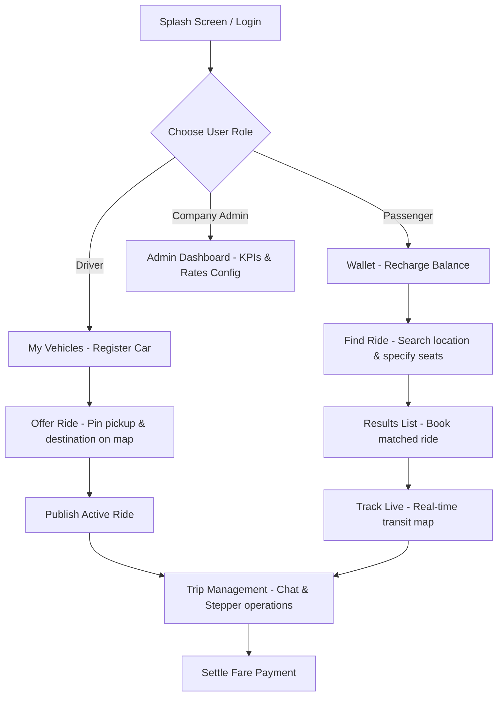

# CommuteSync — Enterprise Carpooling Platform

CommuteSync is a modern, highly interactive, and responsive Enterprise Carpooling Platform built using **Django** and a client-side stack consisting of **Bootstrap 5, HTMX, Alpine.js, Leaflet.js, and Chart.js**. 

The application utilizes a curated visual design system ("Sunrise Commute" teal-coral palette) tailored for corporate employee commutes to campuses.

---

## 🚀 Getting Started & Installation

### 1. Requirements & Setup
Ensure you have Python and Django installed on your system:
```bash
pip install django
```

### 2. Run Database Migrations
Create the SQLite database tables:
```bash
python manage.py migrate
```

### 3. Seed Initial Demo Data
Populate the database with ready-to-test user accounts, vehicles, and active commutes:
```bash
python manage.py seed_data
```

### 4. Start the Server
Boot up the Django local development server:
```bash
python manage.py runserver
```
Visit [http://127.0.0.1:8000/](http://127.0.0.1:8000/) in your web browser.

### 5. Run Automated Tests
Verify platform integrity by running the test suite:
```bash
python manage.py test
```

---

## 🔑 Pre-Seeded Accounts for Testing

| Username | Password | Role | Account Details & State |
|---|---|---|---|
| `john_doe` | `password123` | Employee (Driver) | Owner of a Silver Toyota Prius, has pre-saved Home/Campus coordinates, and has listed an active ride departing today. |
| `jane_smith` | `password123` | Employee (Passenger) | Has $80.00 wallet balance. Ready to search, book seats, chat, and simulate tracking. |
| `admin` | `admin123` | Company Administrator | Accesses the separate Admin Panel to modify fleet configurations and manage employees. |

---

## 🔄 User Workflows & System Architecture



### 🚗 Driver Workflow
1. **Register a Vehicle**:
   - Go to **My Vehicles** in the nav bar and click **Add Vehicle**.
   - Input car details (make, model, color, license plate, seat capacity) and register it.
2. **Publish a Commute Ride**:
   - Click **Offer a Ride** from the main dashboard.
   - Use the **Locate Me** button (crosshair) to auto-fill your start location, type a search address to get Nominatim geocoding suggestions, or click directly on the Leaflet map to set your **Pickup** (coral pin) and **Destination** (teal pin).
   - The map computes the direct distance and automatically fills in a recommended fuel fare.
   - Fill in departure details, select your vehicle, choose capacity, and click **Publish**.
3. **Trip Management Lifecycle**:
   - Access the trip details page. Track progress visually using the horizontal stepper: `Booked` &rarr; `Started` &rarr; `In Progress` &rarr; `Completed` &rarr; `Paid`.
   - Toggle status controls: click **Start Journey** to begin, then **Mark In Progress** when in transit, and **Mark Completed** when you arrive.
   - Coordinate coordinate-specific details inside the chat room.

---

### 🚶 Passenger Workflow
1. **Recharge Wallet**:
   - Go to **Wallet** to check your balance. Add funds (e.g. $25, $50) using the quick-recharge form.
2. **Search for Campus Rides**:
   - Click **Find a Ride** on the dashboard.
   - Enter your pickup location and destination. Suggestions appear automatically via geocoding autocomplete as you type.
   - Select the number of **Seats Needed** (e.g., searching for 3 seats will filter out any driver who only has 2 seats available).
3. **Book and Confirm**:
   - Browse the matching list of active commutes (sorted by closest pickup proximity within 10 km).
   - Select your seats and click **Book Seat**. The fare is calculated and held securely.
4. **Live Transit Tracking & Chat**:
   - Click **Track Live** on your active trip.
   - A floating bottom sheet displays real-time ETA, distance left, and driver/vehicle details.
   - The map renders a car icon that smoothly animates and updates along the path route.
   - Chat with your driver inside the integrated HTMX chat component (polls every 5 seconds).
5. **Settle Payment Checkout**:
   - Once the driver completes the trip, go to **Pay Now**.
   - Settle the ticket fare using Credit Card, UPI, cash, or your Commute Wallet.

---

### 💼 Company Administrator Workflow
1. **Operations Overview**:
   - Log in as `admin`. You are routed to the Admin sidebar layout.
   - Review global KPIs (total employees, registered fleet vehicles, active pools, completed commutes).
2. **Employee & Fleet Rosters**:
   - Browse registered corporate user lists, departments, and active wallet balances.
   - Verify registered employee vehicles and plate numbers.
3. **Global Rate Settings**:
   - Go to **System Configuration**.
   - Customize Organization Name and adjust sliders for Fuel Cost coefficients and Travel Cost rates per kilometer. The recommended driver fares recalculate instantly platform-wide.
